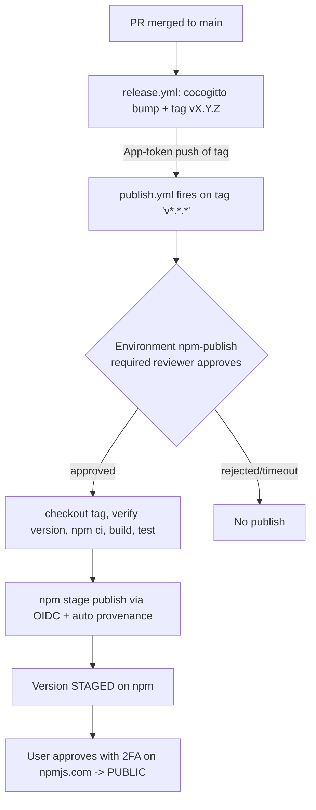

# Secure npm Publish Pipeline (PoC) — Implementation Plan

This document is the **plan of record** and the **manual-steps checklist** for adding a secure
npm *publish* step to this repository. It complements `release-poc.md` (the *release* PoC) — it does
**not** replace it.

- Repo: `github.com/schoubey-gds/github-app-test-repository`
- Publish target: **public npm registry**, **public package**, owned by the user's personal npm
  account. This is a **throwaway** package to be deleted after the PoC.

---

## Problem statement

The existing PoC handles the **release** step (compute semver from conventional commits → bump
`package.json` → commit + tag + GitHub Release, authenticated via a GitHub App token so it can push to
protected `main`). It does **not** publish to any registry.

This plan adds a **publish** step to the public npm registry, modelled on current (mid-2025+) OSS best
practice, designed so it **cannot be triggered by mistake or maliciously**.

> Signing of commits/tags is **out of scope** for now and intentionally not implemented.

---

## Confirmed requirements

- **Target:** public npm registry, public package, under the user's personal npm account (throwaway).
- **Trigger:** `v*.*.*` **tag push** — the tag created by the release job is the trusted handoff
  signal. **No** publish on `pull_request` or arbitrary push.
- **Human gate:** protected GitHub **Environment** (`npm-publish`) **with required reviewers** — every
  publish waits for explicit approval.
- **Auth:** npm **Trusted Publishing via OIDC** — **no** long-lived npm token stored anywhere.
- **Publish mode:** **staged publishing** — CI runs `npm stage publish`; the version is held until the
  user approves it on npmjs.com with **2FA** before it becomes public.
- **Provenance:** **automatic** (public repo + public package + OIDC). Do **not** pass `--provenance`
  (it is emitted by default).
- **Threat coverage:** forked-PR publish, leaked token, build tampering, replay/re-run.

The **user** performs all npmjs.com config and GitHub repo Settings (Environment, reviewers) manually.
The repo changes (files) are provided here; no commits, no repo/npm settings changes, and no actual
publish are performed automatically.

---

## Key technical facts (current as of 2025+)

- npm Trusted Publishing with OIDC went **GA 2025-07-31**. Requires **npm CLI ≥ 11.5.1** and
  **Node ≥ 22.14.0**.
- OIDC trust binds to: **org/user + repository + workflow filename + (optional) environment name**.
  These must match **exactly** on npmjs.com, including the `.yml`/`.yaml` extension and case. The
  configured workflow filename must be **`publish.yml`**.
- Provenance is emitted **by default** under OIDC from a **public repo** publishing a **public
  package**; no `--provenance` flag. **Not** generated for private repos.
- `package.json` `repository.url` must **exactly** match the GitHub repo URL, or publish is rejected.
- `"private": true` **blocks** publishing — it must be removed.
- npm **rejects republishing an existing version** (immutability) — the core replay defense.
- Staged publishing: the trusted publisher's **Allowed actions** must permit `npm stage publish`.
  `npm stage approve/reject` require **interactive 2FA** (CLI or npmjs.com) and cannot use OIDC — that
  is the manual gate.
- A push made by the **GitHub App token** (unlike the default `GITHUB_TOKEN`) **does** re-trigger
  workflows, so the release job's tag push will correctly fire `publish.yml`.

---

## Pipeline shape

```
PR merged to main
   → release.yml (cocogitto bump + tag vX.Y.Z, pushed via GitHub App token)
      → tag push fires publish.yml
         → protected environment `npm-publish` pauses for required-reviewer approval
            → on approval: checkout tag → verify tag == package.json version
                          → npm ci → build → test
                          → npm stage publish via OIDC (+ automatic provenance)
               → version STAGED on npm (not yet public)
                  → user approves staged version with 2FA on npmjs.com
                     → PUBLIC
```



---

## Threat → gate mapping

| Threat | Gate(s) that address it |
| --- | --- |
| **Forked / contributor PR publishes** | Publish triggers **only** on `v*` tag push (forks cannot push tags to this repo); job bound to the protected `npm-publish` environment; **no** `pull_request` trigger; `id-token: write` is not granted to any PR workflow. |
| **Leaked / exfiltrated npm token** | **OIDC trusted publishing** means no long-lived token exists; plus npm **"disallow tokens + require 2FA"** on the package. The short-lived OIDC credential cannot be reused. |
| **Build tampering / wrong artifact** | **Automatic provenance attestation** binds the tarball to the exact repo/commit/workflow run; the package is **built from the checked-out tag** in the same job. |
| **Replay / re-running an old workflow** | npm **rejects duplicate versions**; the environment **required reviewer** gates every run; a **tag == package.json version** check fails fast on mismatch; (recommended) **tag protection** so only the App/release actor can create `v*` tags. |

---

## Manual checklist (performed by the user)

### A. npmjs.com — package + account

- [ ] **Enable 2FA** on the npm account (required for staged-publish approval and OIDC hardening).
- [ ] **Bootstrap the package name (one-time).** npm has **no "create package" button** on the
      website — a package only comes into existence the first time it is published from the CLI. This
      creates a chicken-and-egg problem: the Trusted Publisher (OIDC) settings live on the package's
      settings page, which does not exist until the package does. Break the cycle with a one-time
      **bootstrap publish** of a bare `0.0.0` stub (no WIP code shipped), using the provided script:

      ```bash
      npm login          # browser-based, 2FA
      npm whoami         # confirm it matches the @schoubey-gds scope in package.json
      ./publish-v0-to-npm.sh   # publishes @schoubey-gds/<name>@0.0.0 --access public, then opens the access page
      ```

      - The package name published here **must match** the `name` in `package.json`
        (currently `@schoubey-gds/release-poc`). The stub `0.0.0` and your real released versions
        (e.g. `0.2.0`) coexist under the same package.
      - After this, the package's **Settings** page exists and steps B–D below become possible.

### B. npmjs.com — trusted publisher (OIDC)

Package **Settings → Trusted Publisher → GitHub Actions**, configure **exactly**:

- [ ] **Organization or user:** `schoubey-gds`
- [ ] **Repository:** `github-app-test-repository`
- [ ] **Workflow filename:** `publish.yml`  *(filename only, with the `.yml` extension, case-sensitive)*
- [ ] **Environment name:** `npm-publish`
- [ ] **Allowed actions:** allow **`npm stage publish`** (staged publishing). Do not enable direct
      `npm publish` if you want to force the staged flow.

> npm does **not** validate this config on save — a mismatch only surfaces as an auth error at publish
> time. Double-check every field.

### C. GitHub — protected environment

Repo **Settings → Environments → New environment**:

- [ ] **Name:** `npm-publish`  *(must match the workflow and the npm trusted-publisher config)*
- [ ] **Required reviewers:** add yourself (every publish waits for approval; self-review is allowed
      for a single-maintainer PoC).
- [ ] **Deployment branches and tags:** restrict to **tags** matching `v*.*.*` only.
- [ ] **Secrets:** none — OIDC needs no stored npm token.

### D. After OIDC works (hardening)

- [ ] npmjs.com package **Settings → Publishing access → "Require two-factor authentication and
      disallow tokens"**. This makes any leaked token useless while OIDC keeps working.

### E. Teardown (after the PoC)

- [ ] Approve or reject the staged version, then **unpublish/delete** the throwaway package on
      npmjs.com.
- [ ] **Remove the trusted publisher** configuration from the (now deleted) package.
- [ ] Optionally delete the `npm-publish` GitHub environment.

---

## Task breakdown

### Task 1 — Prerequisites + verifiable baseline (repo files, no publish)
- `package.json`: add `repository` (`git+https://github.com/schoubey-gds/github-app-test-repository.git`),
  set a publishable `name` (`@schoubey-gds/release-poc`), **remove**
  `"private": true`, keep `"type": "module"`.
- `.nvmrc`: pin to a version **≥ 22.14.0**.
- Verify with `npm publish --dry-run` (correct tarball/name/version, no `private` error).

### Task 2 — Protected GitHub Environment (manual, by user)
- Documented in the checklist above (section C). The workflow references `environment: npm-publish`.

### Task 3 — `publish.yml` (tag trigger + environment gate + placeholder)
- `on: push: tags: ['v*.*.*']` (+ optional `workflow_dispatch`).
- `permissions: contents: read` top-level; job-level `id-token: write`, `contents: read`.
- Job `environment: npm-publish`, checkout the pushed tag, `setup-node` from `.nvmrc`.
- Third-party actions **pinned to commit SHAs**.

### Task 4 — Tag/version integrity check
- Compare `${GITHUB_REF_NAME}` (minus the `v` prefix) to `package.json` version; fail on mismatch.

### Task 5 — OIDC staged publish + automatic provenance
- Ensure npm ≥ 11.5.1, then `npm ci` → `npm run build --if-present` → `npm test` (if present) →
  `npm stage publish` (no token, no `--provenance` flag).

### Task 6 — End-to-end validation, 2FA approval, teardown
- Merge a `feat:`/`fix:` change → release → tag → publish workflow → approve environment → OIDC staged
  publish → approve staged version with 2FA → public with provenance badge.
- Verify defenses: `pull_request` never triggers publish; duplicate-version re-run is rejected; no npm
  token in repo secrets.
- Then harden (section D) and tear down (section E).

---

## Constraints honoured by the automated changes

- No GitHub repo settings, environments, branch/tag protection, or npmjs.com settings are changed —
  those are the user's manual steps (documented above).
- Nothing is published or staged to npm automatically.
- No git commits are created automatically.
- No commit/tag signing is added.
- Third-party GitHub Actions are pinned to commit SHAs.
- The repository URL is derived from the actual `origin` remote (`schoubey-gds/github-app-test-repository`).
- The npm package name is `@schoubey-gds/release-poc`. Because npm has no "create package" action on
  the website, the package is created via a one-time **bootstrap publish** (`publish-v0-to-npm.sh`)
  before OIDC/trusted-publisher config is possible — see checklist section A.
